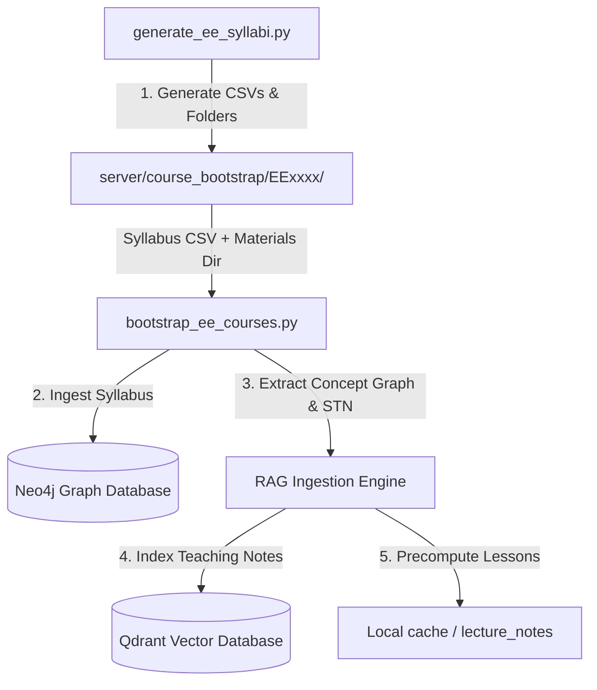

# Team - 2 Changes

This branch incorporates the **Token Optimization Framework** alongside existing EE Syllabi Pipeline and startup configuration updates.

---

## 1. Token Optimization Framework

We have implemented an end-to-end token optimization pipeline designed to minimize LLM token consumption, reduce latency, and lower API usage costs across both standard text/history prompts and real-time streaming operations.

### Key Optimization Components
* **Input Minification (`server/utils/tokenOptimizer.js`):**
  * Automatically removes HTML/markdown comments and collapses unnecessary whitespace/newlines before payloads are sent to LLMs.
  * Respects code blocks (delimited by ` ``` `), keeping indentation and block content completely intact.
* **Shorthand Abbreviation System:**
  * Injects a token-saving directive into system prompts instructing the models to respond using standard, predefined abbreviations (e.g. `w/` for `with`, `db` for `database`, `ctx` for `context`, etc.).
* **Response Expansion (Standard & Streaming):**
  * Intercepts outbound model completions and restores all abbreviated terms back to their full, human-readable forms.
  * Incorporates a stateful `StreamingTokenExpander` in `server/services/llmStreamingService.js` that tracks partial chunk buffers to perform seamless word-boundary-aware expansion during streaming (so words are not fragmented).
* **Multi-Provider Support:**
  * Automatically optimizes inputs and expands outputs for **Gemini** (`geminiService.js`), **Groq** (`groqService.js`), and **SGLang** (`sglangService.js`).

---

## 2. Model Optimization Framework

We have implemented a comprehensive Model Optimization Framework that improves model routing decisions, tunes parameters dynamically on the fly, manages context windows safely, and ensures fault-tolerant provider recovery.

### Key Optimization Components

* **Dynamic Context-Aware Parameter Tuning (`server/services/smartModelRouterService.js`):**
  * **Code & Math Detection:** Analyzes the syntax of queries for specific domain keywords (e.g. `def `, `class`, `const`, `matrix`, `integral`, `eigenvalue`).
  * **Deterministic Forcing:** Automatically sets a highly precise temperature (`0.2`) for mathematical or code generation tasks to optimize factual correctness and syntactic validity.
  * **Research-Aware Window Allocation:** Automatically scales `temperature` to `0.2` and allocates up to `8192` output tokens when in Deep Research mode to support elaborate long-form responses.
  
* **Hybrid Quality-Cost Routing:**
  * Minimizes latency and costs by routing simple queries (complexity score `<= 35`) or standard questions to local SLMs/Ollama models.
  * Automatically shifts high-complexity queries (complexity score `>= 75`) to capable cloud-backed fallback models (e.g., Llama 3.3 70B on Groq, Gemini 2.0 Flash) to prevent the generation of poor or incomplete answers.
  * Adjusts target cloud providers based on token requirements (routing longer requests to Gemini and shorter requests to Groq).

* **Automatic Context Window Management & History Truncation:**
  * Prevents upstream API failures (e.g. Groq 8k context length limits returning HTTP 400 bad requests).
  * Measures context payload length dynamically using characters-to-tokens approximations.
  * Automatically drops older conversation turns sequentially while strictly preserving developer/system instructions and the active user prompt.

* **Resilient Provider Fallback & Health-Checks (`server/services/llmFallbackService.js`):**
  * Fixed duplicate variable declarations, duplicate switch cases, and duplicate Set definitions.
  * Ensured seamless and robust fallback chain processing (`sglang` $\rightarrow$ `groq` $\rightarrow$ `gemini` $\rightarrow$ `ollama`) for both standard generation and chunked streaming modes.

### Verification of Optimization Features

We have built dedicated verification test suites to ensure both the Token and Model Optimization frameworks perform flawlessly.

#### 1. Token Optimizer Tests
Execute the following command to test minification, response expansion, case-preservation, JSON-safety, and split backtick safety:
```bash
node server/tests/test_token_optimizer.js
```

#### 2. Model Router Tests
Execute the following command to verify complexity calculations, domain parameter tuning, hybrid routing logic, and context window truncation:
```bash
node server/tests/test_model_router.js
```

---

## 3. EE Syllabi Pipeline & Startup Configuration Update

This section describes the changes introduced in the `ee-syllabi-generator` branch, the architecture of the new Electrical Engineering (EE) syllabi pipeline, and the test cases/verification steps for the testing team.

### 3.1. Summary of Changes

### A. Dynamic Startup Configuration (`startup.sh`)
* **Before:** `PROJECT_DIR` was hardcoded to `/run/media/komeshbathula/New Volume1/NIT Projects/iMentor-Main`.
* **After:** Updated to determine the project directory dynamically at runtime using bash-native script path resolution:
  ```bash
  PROJECT_DIR="$(cd "$(dirname "${BASH_SOURCE[0]}")" && pwd)"
  ```
  This makes the system environment-agnostic and prevents failures when running on different developer environments or OS paths.

### B. Automated EE Syllabi Generator (`server/scripts/generate_ee_syllabi.py`)
* A Python script designed to output structured `syllabus.csv` files for all **17 Electrical Engineering (EE)** theory courses listed in the curriculum (e.g., `EE1011`, `EE1021`, `EE2011`, etc.).
* Outputs CSVs matching the required database schema headers:
  `Module,Lecture Number,Lecture Topic,Subtopics,Resources`
* Dynamically creates the corresponding directories under `server/course_bootstrap/` along with an empty `materials/` folder for each course to satisfy the course ingestion scanner.

### C. Batch Course Bootstrapper & STN Pipeline (`bootstrap_ee_courses.py`)
* A batch-runner script located in the project root that discovers all EE courses generated under `server/course_bootstrap/`.
* Programmatically invokes the `bootstrap_course` process for each course to:
  1. Ingest the syllabus into **Neo4j** (mapping Module $\rightarrow$ Topic $\rightarrow$ Subtopic).
  2. Extract the course **Concept Graph**.
  3. Build **Qdrant Vector Database Collections**.
  4. Generate and cache **Subtopic Teaching Notes (STN)** in the background using the LLM's base knowledge.

---

### 3.2. Ingestion Architecture Flow



---

### 3.3. Testing Team Instructions

Please follow the verification steps below to test the dynamic path configuration, syllabus generation, and STN ingestion.

### Phase 1: Verify Startup script
1. Run syntax checks on `startup.sh`:
   ```bash
   bash -n startup.sh
   ```
2. Verify that running `startup.sh` properly activates the Conda environment and starts up Node and Python backends without pointing to a hardcoded path.

### Phase 2: Test Syllabi Generation
1. Clean up any existing `server/course_bootstrap/EE*` folders (if any).
2. Execute the generator script:
   ```bash
   python3 server/scripts/generate_ee_syllabi.py
   ```
3. **Verify Output:**
   * Ensure 17 new folders starting with `EE` are created under `server/course_bootstrap/`.
   * Check that each folder contains:
     * `syllabus.csv` (Verify it has columns: `Module`, `Lecture Number`, `Lecture Topic`, `Subtopics`, `Resources`).
     * `materials/` directory (Verify it is created).

### Phase 3: Test Batch STN Ingestion Pipeline
1. Ensure the Python RAG service is running (default port is `2001`).
2. Run the batch bootstrapper script:
   ```bash
   python3 bootstrap_ee_courses.py
   ```
3. **Verify Neo4j Integration:**
   * Open the Neo4j browser or run a Cypher query to verify that nodes for `EE1011`, `EE1021`, etc. have been created with `Module`, `Topic`, and `Subtopic` relationship linkages.
4. **Verify Qdrant Ingestion:**
   * Check Qdrant collection `stn_notes` to verify that teaching notes have been generated, embedded, and successfully indexed for the respective EE subtopics.
5. **Verify API Endpoints:**
   * Test querying the backend for a specific subtopic STN:
     ```bash
     curl http://localhost:2001/stn/EE1011%20Basic%20Electrical%20Circuits/introduction_to_circuit_elements
     ```
   * Confirm that the RAG service returns cached teaching notes with a `success: true` response.
